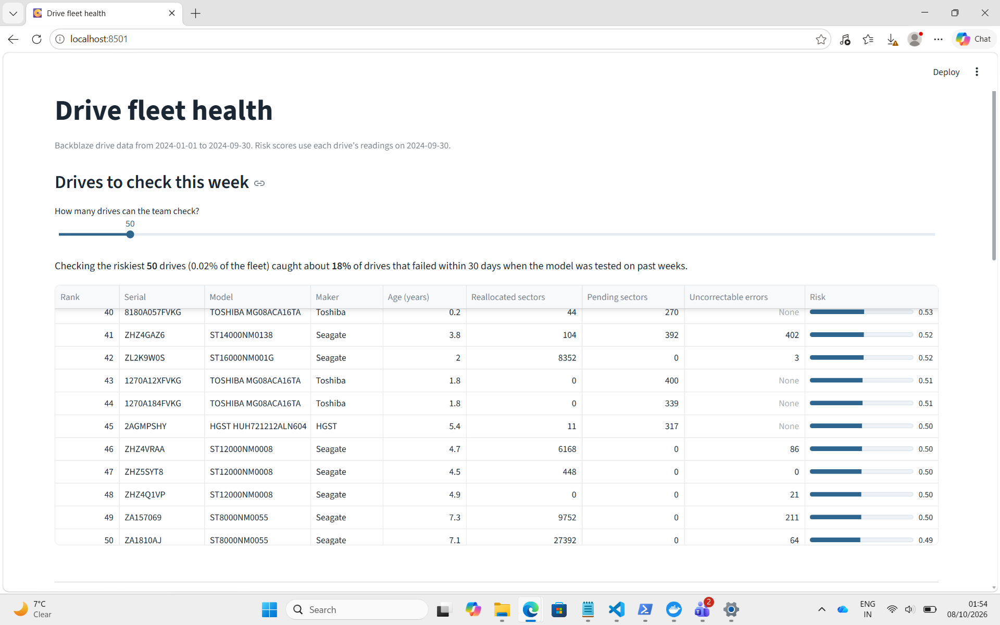
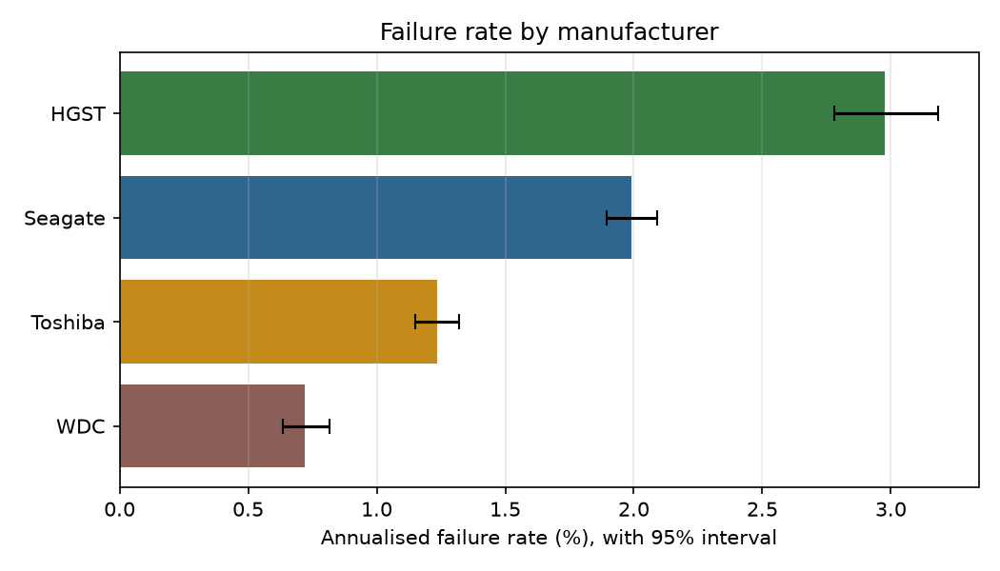
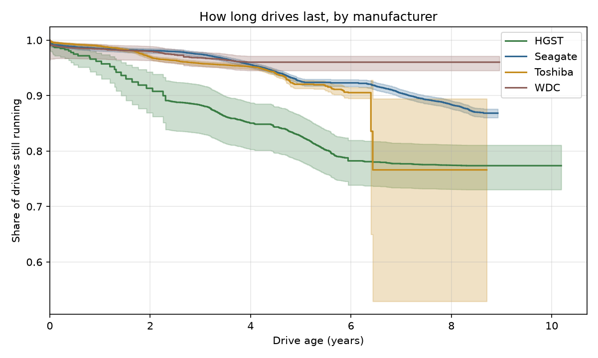
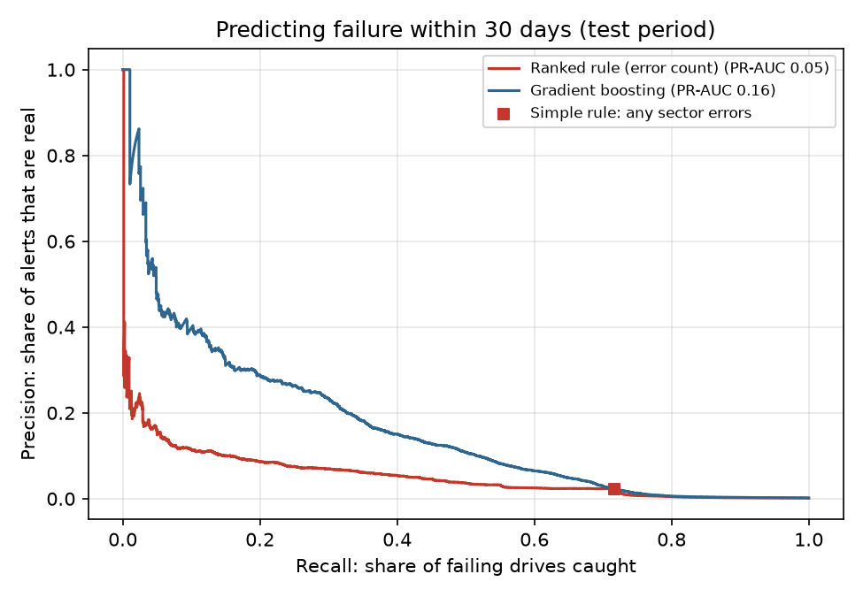
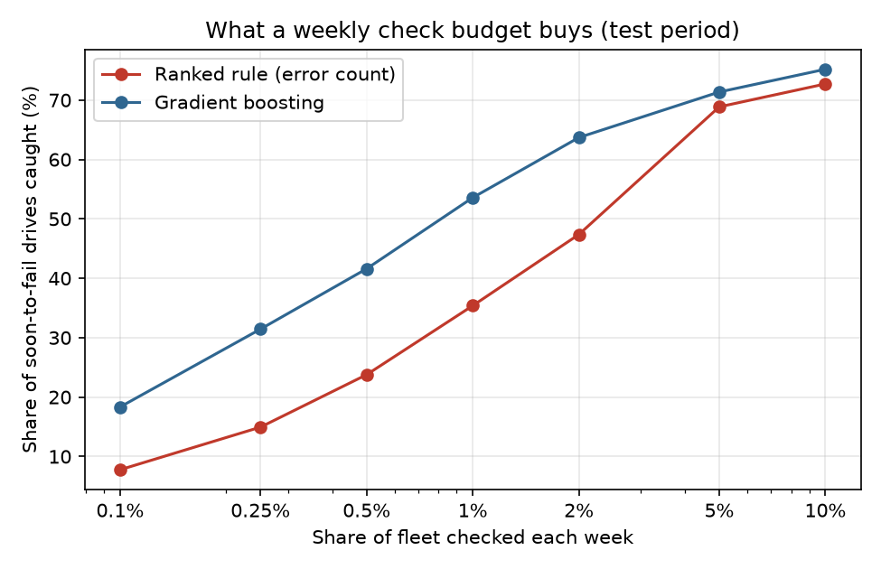
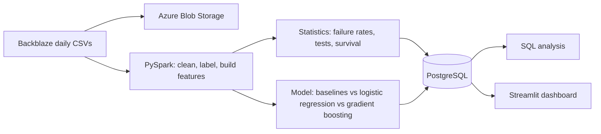

# Predicting hard-drive failures before they happen

[](https://github.com/maddyrech/drive-failure-prediction/actions/workflows/tests.yml)

Data centres replace drives after they fail, which means downtime, rebuilds and rushed swaps. This project asks a simple operations question: **if a team can only check a small number of drives each week, which ones should they check?**

I used [Backblaze's Drive Stats data](https://www.backblaze.com/cloud-storage/resources/hard-drive-test-data), the daily health readings (SMART data) of every hard drive in their data centres, to:

- measure how often drives fail by manufacturer, model and age, and test whether the differences are real
- find which warning signs actually matter
- build a model that ranks drives by their risk of failing in the next 30 days
- put it all in a dashboard an operations manager could use on Monday morning

## Results

76.8 million daily records from 310,999 data drives, January to September 2024. The model was chosen on validation weeks (April to May) and tested once on later, untouched weeks (June to August).

**Which drives to check.** If the team checks the riskiest 1% of drives each week, the model catches **54% of the drives that fail within the next 30 days**. Checking drives in order of their error counts catches 35%, so the model finds **1.5x as many failures for the same effort**. About 1 in 11 of its checks finds a drive that is about to fail, roughly 50 times better than picking drives at random. Validation weeks gave a similar 51%, so the result is stable rather than lucky.

**Where the model doesn't help.** With a bigger budget the advantage disappears: checking every drive that reports sector errors (5.2% of the fleet) catches about 72% of failures, and the model checking the same number of drives does the same. The model's value is getting more out of a small number of checks.

**Warning signs.** Drives that reallocated even one sector were **29x more likely to fail** (95% CI 27.5x to 31.3x). Of drives that showed sector errors, 15.2% failed during the period, against 0.26% of drives that didn't.

**Manufacturers and models.** Annualised failure rates ranged from 0.72% (WDC) to 2.98% (HGST), and the difference is far beyond chance (exposure-adjusted chi-square, p < 10^-100). Individual models matter more than brands: one Seagate 12 TB model failed at 12.2% a year, while other Seagate models ran below 2%.

**Age.** Failure rates follow the classic "bathtub curve" of hardware: 1.55% for drives under a year old, dropping to 0.97% at 1 to 2 years, then rising steadily to 2.43% for drives over 5 years old.

Full numbers are in [`reports/results_summary.md`](reports/results_summary.md) and [`reports/sql_results.md`](reports/sql_results.md).



| | |
|---|---|
|  |  |
|  |  |

## How it works



1. **PySpark pipeline** (`src/spark_etl.py`) reads every daily file. Backblaze has changed the file layout over the years, so files are grouped by header and joined by column name. It drops boot SSDs, finds each drive's failure date, and builds weekly snapshots with each SMART signal and how much it changed in the last 7 days.
2. **Statistics** (`src/stats_analysis.py`) computes annualised failure rates with exact Poisson confidence intervals, tests whether manufacturers really differ, measures how much more likely drives with reallocated sectors are to fail, and draws Kaplan-Meier survival curves by drive age.
3. **Model** (`src/train_model.py`) compares two non-ML baselines (flag any drive with sector errors; rank drives by error count) with logistic regression and gradient boosting, choosing on validation weeks and testing once on later weeks.
4. **PostgreSQL** holds the results. `sql/analysis.sql` answers the fleet questions directly in SQL, and the dashboard reads from the same tables.
5. **Dashboard** (`app/dashboard.py`) leads with the decision: the drives to check this week, and how many failures that budget would have caught in testing.

## Decisions worth explaining

- **Data drives only.** Backblaze also logs the small drives that boot its servers (laptop-size HDDs and SSDs under 1 TB). They do a different job and had failure rates up to 20%, so they're excluded.
- **The model is chosen on validation weeks, then tested once.** Time runs left to right: inner training weeks, a 30-day gap, validation weeks, another gap, then the untouched test weeks. Candidates are compared on validation; only the winner is scored on test. Picking the best model by its test score would quietly overstate it.
- **The last 30 days are left out for every drive.** We can only know whether a drive failed within 30 days if we can see 30 days ahead. Keeping only the drives that went on to fail in those final weeks would make them look far riskier than they were.
- **Sampling is undone in evaluation.** Failures are rare, so only 5% of healthy drive-weeks are kept for training. Each kept row carries a weight of 20, so every metric reflects the real fleet's balance.
- **The metric matches the job.** Accuracy is meaningless when 99.9% of drives are fine. I report PR-AUC, and more usefully, recall at a fixed weekly check budget: "check the riskiest 1%, catch X% of upcoming failures".
- **The model has to beat a strong simple baseline.** Not just "flag any drive with sector errors", but "check drives in order of how many errors they report". The model is also given those error counts directly, so the comparison is about whether the extra signals add anything.
- **Survival curves account for late entry.** Drives join the data already partway through their life. The Kaplan-Meier fit uses each drive's age when first seen (left truncation), otherwise old drives look unrealistically reliable.
- **Risk scores rank; they aren't probabilities.** Class weighting shifts the scores, so the dashboard uses them to order drives only.

## Run it yourself

**Requirements:** Python 3.11+, Java 17+ (for Spark), and Docker for the database. About 10 GB of free disk for two quarters of data.

### Quick test on simulated data (2 minutes)

```bash
python -m venv .venv
source .venv/bin/activate          # Windows: .venv\Scripts\activate
pip install -r requirements.txt
cp .env.example .env               # Windows: copy .env.example .env
docker compose up -d db
python -m src.run_pipeline --sample
streamlit run app/dashboard.py
```

The simulated data only proves the code runs. Its numbers mean nothing.

### Real data

```bash
python -m src.run_pipeline         # downloads the quarters listed in .env, then runs everything
streamlit run app/dashboard.py
```

Each step can also run on its own: `python -m src.download`, `src.spark_etl`, `src.stats_analysis`, `src.train_model`, `src.load_postgres`, `src.run_sql`, `src.write_summary`.

### Everything in Docker (easiest on Windows)

```bash
docker compose up -d db
docker compose run --rm pipeline python -m src.run_pipeline
docker compose up dashboard        # then open http://localhost:8501
```

## Tests

19 automated tests (pytest) run on every push through GitHub Actions. They focus on the logic that decides whether the results can be trusted:

- **Labelling:** a drive is labelled "fails within 30 days" correctly, and nobody's label is used in the final 30 days of data. This test was written to catch a real bug found during development, and fails if that bug is reintroduced.
- **Leakage:** the time-based split always leaves a 30-day gap between training and testing.
- **Evaluation:** the weekly check-budget metric gives 100% for a perfect model, about chance for random scores, and respects sampling weights.
- **Cleaning:** manufacturers are recognised from model names, and boot drives under 1 TB are removed.
- **Statistics:** failure rates, confidence intervals and hypothesis tests behave as expected on known data.

Run them locally with:

```bash
pip install -r requirements-dev.txt
pytest -v
```

## Running on Azure

1. **Storage account** (data lake): in the Azure portal create a Storage account in the North Europe region with Standard LRS. Copy the connection string from *Access keys* into `AZURE_STORAGE_CONNECTION_STRING` in `.env`.
2. **Database**: create an *Azure Database for PostgreSQL flexible server*, Burstable B1ms tier. Under *Networking*, allow your own IP address. Put its address in `DATABASE_URL` in `.env` (the format is in `.env.example`, including `sslmode=require`).
3. Run `python -m src.run_pipeline --skip-download --azure`. This uploads the raw and processed data to Blob Storage and loads the results into the Azure database. The dashboard then reads from Azure.
4. Stop the database server when you're not using it, and delete the resource group when you're done, to avoid charges.

## Project structure

```
src/
  config.py            settings, paths, SMART attributes
  download.py          fetch Backblaze quarters
  make_sample_data.py  simulated data for testing
  spark_etl.py         PySpark cleaning, labels, features
  stats_analysis.py    failure rates, hypothesis tests, survival curves
  train_model.py       rule vs logistic regression vs gradient boosting
  load_postgres.py     load results into PostgreSQL
  run_sql.py           run sql/analysis.sql, save results
  upload_to_azure.py   push data to Azure Blob Storage
  write_summary.py     headline numbers
  run_pipeline.py      run everything in order
sql/analysis.sql       fleet analysis queries
tests/                 pytest tests, run by GitHub Actions on every push
app/dashboard.py       Streamlit dashboard
reports/               figures and results
```

## Limitations

- SMART reporting differs between manufacturers and models, so the same raw value can mean different things on different drives.
- Some drives fail with no warning in their SMART data. No model built on these signals can catch those.
- The age-band SQL query assigns each drive's running time to its age at the end of the period, which is an approximation.
- Results describe Backblaze's fleet and workloads, which may not match other data centres.

## Data

Hard drive data from Backblaze, published at [backblaze.com](https://www.backblaze.com/cloud-storage/resources/hard-drive-test-data). Backblaze is the source of the data; the analysis and any errors are mine.
